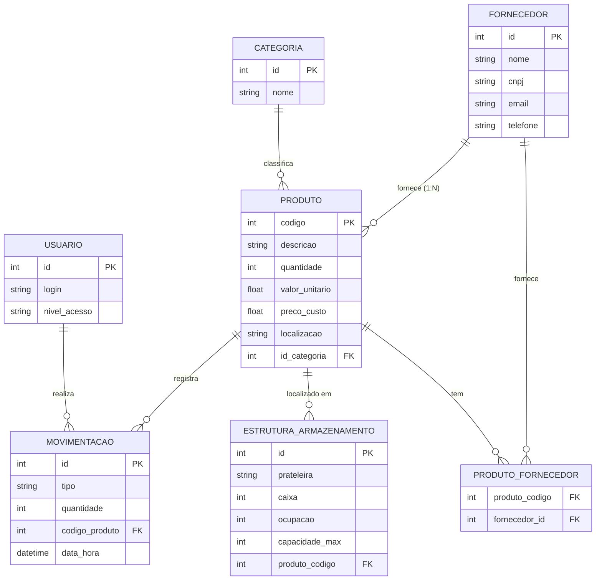

# 📊 Documentação de Dados - Controle de Estoque (Fiel ao BD)

Esta documentação descreve a estrutura física e lógica real do banco de dados `Estoque.db`.

## 1. Modelo Entidade-Relacionamento (MER)

### Entidades e Atributos

- **USUARIO**: Operadores do sistema.
    - `id` (PK), `login` (Único), `senha`, `nivel_acesso`.

- **PRODUTO**: Itens do inventário.
    - `codigo` (PK), `descricao`, `quantidade`, `quantidade_minima`, `valor_unitario`, `preco_custo`, `localizacao`, `id_categoria` (FK), `id_fornecedor` (FK).

- **CATEGORIA**: Agrupamento lógico.
    - `id` (PK), `nome`.

- **FORNECEDOR**: Parceiros comerciais.
    - `id` (PK), `nome`, `contato`, `cnpj`, `email`, `telefone`.

- **MOVIMENTACAO**: Histórico de transações.
    - `id` (PK), `tipo`, `codigo_produto` (FK), `quantidade`, `id_usuario` (FK), `data_hora`.

- **ESTRUTURA_ARMAZENAMENTO**: Gestão física de espaço.
    - `id` (PK), `prateleira`, `caixa`, `ocupacao`, `capacidade_max`, `produto_codigo` (FK).

- **PRODUTO_FORNECEDOR**: Tabela de ligação (N:N).
    - `produto_codigo` (FK), `fornecedor_id` (FK).

- **CATEGORIAS_LOG**: Tabela utilitária de sistema.
    - `nome` (Único).

---

## 2. Diagrama Entidade-Relacionamento (DER)

---
**Sincronização Final:** 17 de Maio de 2026 (Refletindo esquema físico real).

---
**Última Atualização:** 17 de Maio de 2026
**Status:** Sincronizado com v6.0 do Sistema.
