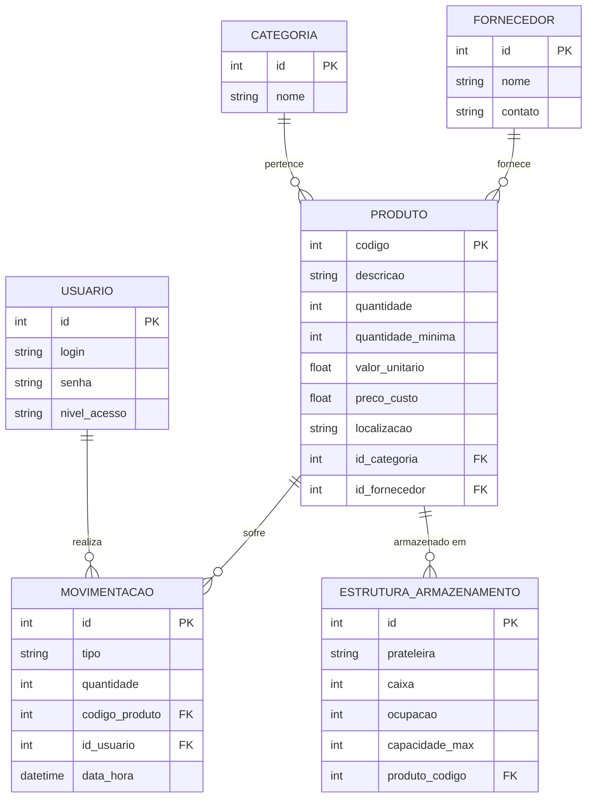

# 📊 Modelo Entidade-Relacionamento (MER) - Controle de Estoque

---
**Nota:** Este diagrama utiliza a sintaxe **Mermaid**, que é renderizada automaticamente como uma imagem no **Obsidian** e no **GitHub**.
