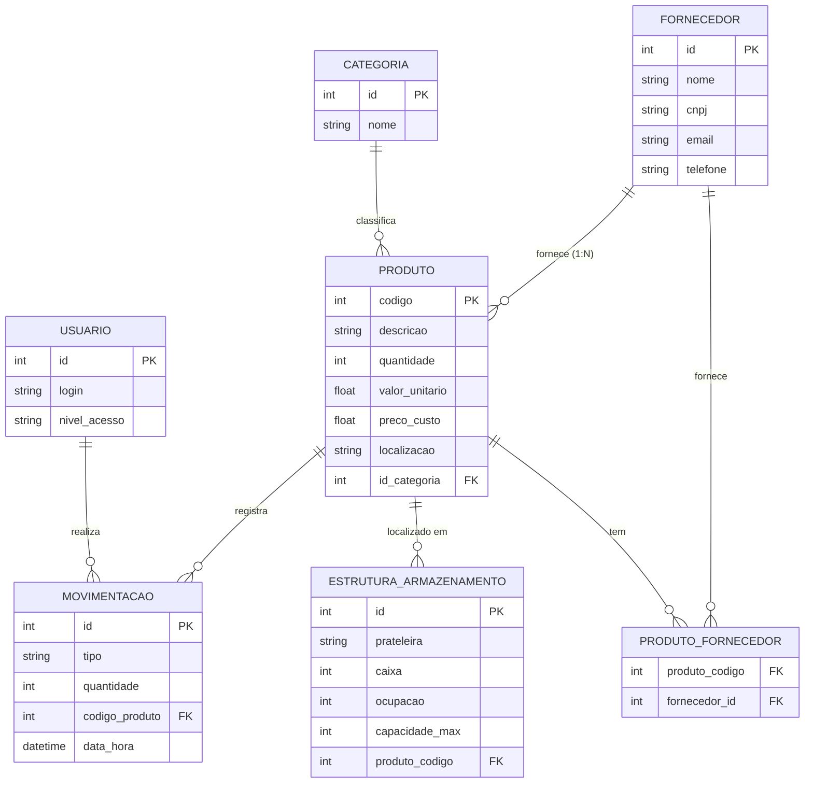

# 📦 Inventory. — Executive Asset Management (v10.0 Corporate)

Sistema de gestão de ativos e controle de estoque de alta performance, desenvolvido em Python com **Streamlit**. O **Inventory.** (v10.0 Corporate Edition) redefine a experiência de BI com uma interface executiva baseada em Glassmorphism e Organic Flow.

## 💎 Design System: Corporate Edition

O projeto utiliza um design system proprietário focado em sobriedade e clareza:
*   **The Glass Metrics:** KPIs envoltos em Glassmorphism para leitura rápida de ativos.
*   **Executive Data Grid:** Tabelas purificadas, sem bordas externas, com tipografia Mono para precisão decimal.
*   **Organic Flow:** Componentes com raios de arredondamento suaves (20px a 35px), eliminando a rigidez industrial.
*   **Shadow Palette:** Interface em tons de Azul Executivo e Dark Mode sóbrio.

## 🚀 Funcionalidades Principais

*   **Intelligence Panel (Dashboard):** Visão analítica profunda com KPIs de Lucro Potencial, Saúde do Estoque e Curva ABC (Pareto).
*   **Auditoria de Ativos (Inventário):** Gestão de SKUs com alinhamento matemático e filtros avançados.
*   **Fluxo de Operações (Compliance):** Registro rigoroso de movimentações com validação de estoque físico.
*   **Gestão de Almoxarifado Dinâmica:** Controle de prateleiras e caixas via `EstruturaController`, permitindo expansão modular do espaço físico.
*   **Compliance de Parceiros:** Gestão de fornecedores com integridade referencial protegida.

## 📊 Arquitetura de Dados

O sistema é alimentado por um banco de dados SQLite relacional, orquestrado pela **Engine v10.0**.



## 🛠️ Tecnologias de Elite

*   **Core:** Python 3.10+
*   **Engine UI:** Streamlit (Corporate Edition)
*   **Data Science:** Pandas & Plotly (BI Dashboards)
*   **Database:** SQLite Relacional (Engine v10.0)

## 🏁 Como Iniciar

1. Instale as dependências:
   ```bash
   pip install -r requirements.txt
   ```
2. Orquestre o Banco de Dados (Schema & Seed):
   ```bash
   python Services/database_engine.py
   ```
3. Inicie o Terminal de Operações:
   ```bash
   streamlit run main.py
   ```

---
*Inventory. — Precision in every asset. (Laboratório de Estudos 2026)*
