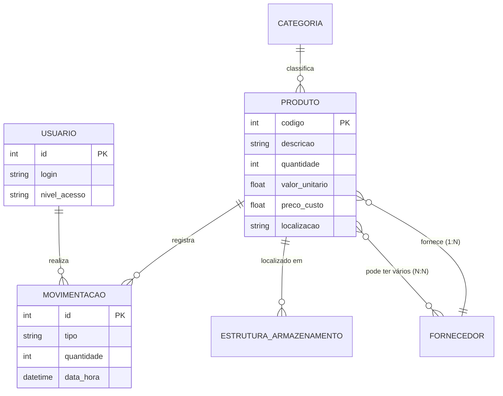

# 📦 Inventory Pro - Controle de Estoque Inteligente (v6.0)

Sistema de gestão de estoque desenvolvido em Python com **Streamlit**, focado em alta usabilidade, análise estratégica de dados e gestão física de almoxarifado.

## 🚀 Funcionalidades Principais

*   **Dashboard Estratégico:** Visão analítica com KPIs financeiros, Curva ABC e acompanhamento de saúde do estoque.
*   **Gestão de Almoxarifado:** Controle físico de prateleiras e caixas com alocação dinâmica.
*   **Relatórios Consolidados:** Unificação de dados de inventário e movimentações com exportação para Excel.
*   **Alertas Críticos:** Sistema de notificação expansível na sidebar para itens abaixo do estoque mínimo.
*   **Segurança e Acesso:** Controle de sessão e autenticação de usuários.

## 📊 Arquitetura do Banco de Dados (DER)

O sistema utiliza um banco de dados SQLite robusto. Para detalhes completos, consulte o [MER_Diagrama.md](./MER_Diagrama.md).



## 🛠️ Tecnologias Utilizadas

*   **Linguagem:** Python 3.10+
*   **Interface:** Streamlit
*   **Banco de Dados:** SQLite
*   **Análise de Dados:** Pandas & Plotly
*   **Estilização:** CSS Customizado integrado ao Streamlit

## 🏁 Como Iniciar

1. Instale as dependências:
   ```bash
   pip install -r requirements.txt
   ```
2. Inicialize ou atualize o banco de dados:
   ```bash
   python Services/inicializar_db.py
   python Services/atualizar_db_v2.py
   ```
3. Execute a aplicação:
   ```bash
   streamlit run main.py
   ```

---
*Desenvolvido como projeto de Laboratório de Estudos - 2026*
