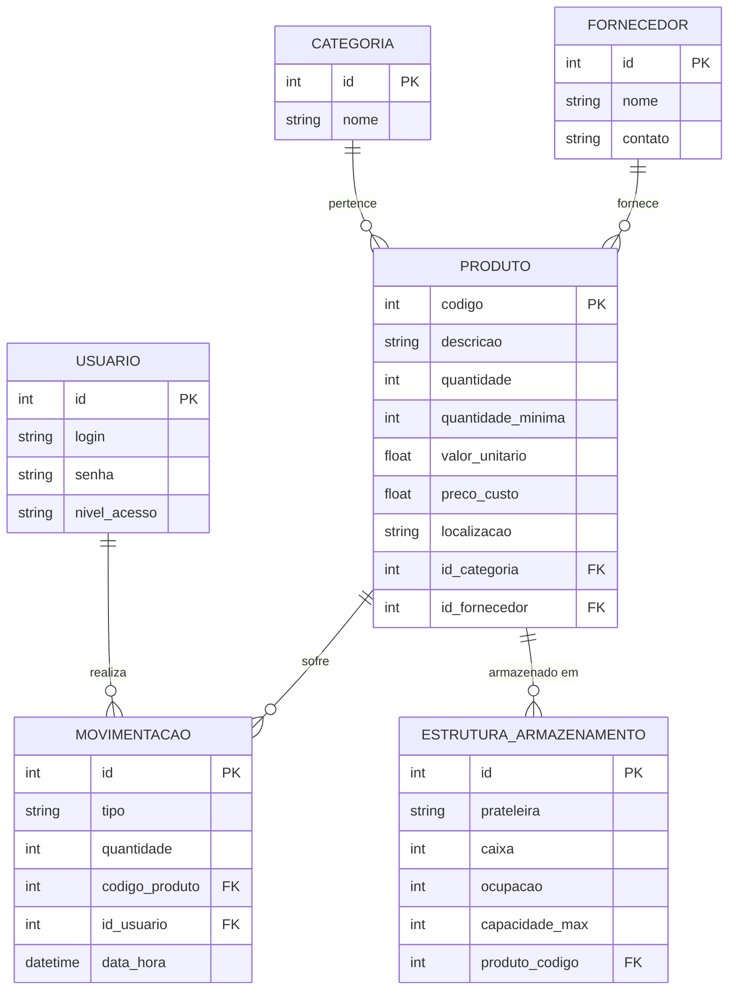

# StockMaster - Controle de Estoque Inteligente

Sistema de gestão de estoque desenvolvido em Python/Flask, focado em alta usabilidade, inteligência operacional e alocação dinâmica de armazenamento.

## 🚀 Funcionalidades Principais

*   **Dashboard Estratégico:** Visão 360° com KPIs de Lucro Potencial, Saúde do Estoque, Dias de Suprimento e Ocupação do Armazém.
*   **Movimentação Inteligente:** Registro de Entradas e Saídas com **Autocomplete** e preview em tempo real.
*   **Alocação Automática:** Gerenciamento de 450 posições (Prateleiras/Caixas) com alocação automática de itens (limite de 10 por caixa).
*   **Inteligência de Reabastecimento:** Sugestão de compra baseada na média de consumo diário dos últimos 30 dias.
*   **Auditoria Completa:** Histórico detalhado de todas as operações com filtros dinâmicos.
*   **Relatórios e Exportação:** Auditoria de inventário com exportação para CSV e suporte a Impressão/PDF.

## 📊 Arquitetura do Banco de Dados (MER)

O sistema utiliza um banco de dados SQLite modelado para garantir integridade e rastreabilidade.



## 🛠️ Tecnologias Utilizadas

*   **Backend:** Python 3 + Flask
*   **Banco de Dados:** SQLite
*   **Frontend:** HTML5, CSS3 (Untitled UI Design System), JavaScript Vanilla
*   **Gráficos:** Chart.js

## 🏁 Como Iniciar

1. Instale as dependências:
   ```bash
   pip install flask
   ```
2. Inicialize o banco de dados (se necessário):
   ```bash
   python Services/inicializar_db.py
   ```
3. Execute o servidor:
   ```bash
   python app_flask.py
   ```
4. Acesse em seu navegador: `http://localhost:5000`

---
*Desenvolvido como projeto de Laboratório de Estudos - 2026*
